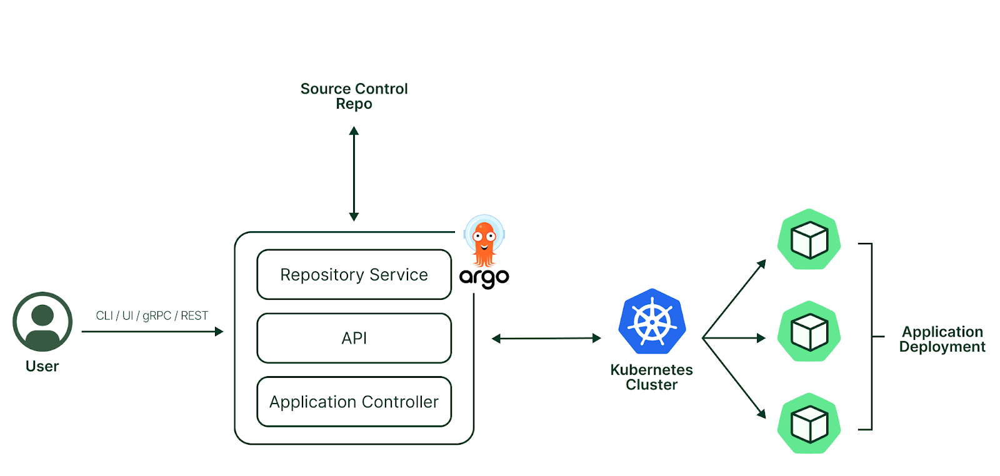

# 🚀 Kubernetes GitOps

## 🎯 Objective

This repository demonstrates a hands-on GitOps workflow using Kubernetes, ArgoCD and Helm charts. It's designed to teach you how to declaratively manage Kubernetes applications through GitOps automation.

With this project, you will learn:

- 🐳 **Kind** for running Kubernetes clusters locally
- ⛵ **Helm** for packaging and deploying applications
- 🎛️ **ArgoCD** for continuous delivery in Kubernetes

---

## 🏗️ Architecture

The ArgoCD architecture is illustrated below:



Components:

- **GitHub**: Source of truth for Kubernetes manifests and Helm charts
- **Kubernetes (Kind)**: Local test cluster to deploy and manage apps declaratively
- **ArgoCD**: Watches Git for changes and syncs applications to the cluster

---

## ⚙️ Prerequisites

To run this project locally, you need:

- 🐳 Docker
- 🧰 `kubectl`, `helm`, and `kind`

---

## 🚀 How to Run the Project Locally

### 1. 📁 Clone the repository

```bash
$ git clone https://github.com/your-username/gitops-k8s-stack.git
$ cd gitops-k8s-stack
```

### 2. ⚙️ Execute the setup script

The `setup.sh` script will:

- Create a local Kubernetes cluster using Kind
- Install ArgoCD in the cluster
- Deploy the sample `nginx` Helm chart

```bash
$ chmod +x scripts/setup.sh
$ bash scripts/setup.sh
```

After the setup, you can access the ArgoCD UI at `http://localhost:8080`.

---

## 🔁 GitOps Workflow

Once the project is running:

- Updating a Helm chart's image tag triggers the GitHub Actions pipeline.
- ArgoCD detects changes and syncs the new manifests into the cluster.

You can also manually dispatch the workflow via GitHub UI with custom inputs.

---

## 🧹 How to Clean Up

To destroy the local environment and clean up all resources, use:

```bash
$ chmod +x scripts/cleanup.sh
$ bash scripts/cleanup.sh
```

This will delete:

- The `argocd` namespace
- The Kind Kubernetes cluster

---

## 🤝 Contributing

Contributions are welcome! Feel free to submit pull requests or open issues.

---

## 📝 License

This project is licensed under the MIT License. See the [LICENSE](LICENSE) file for more information.
